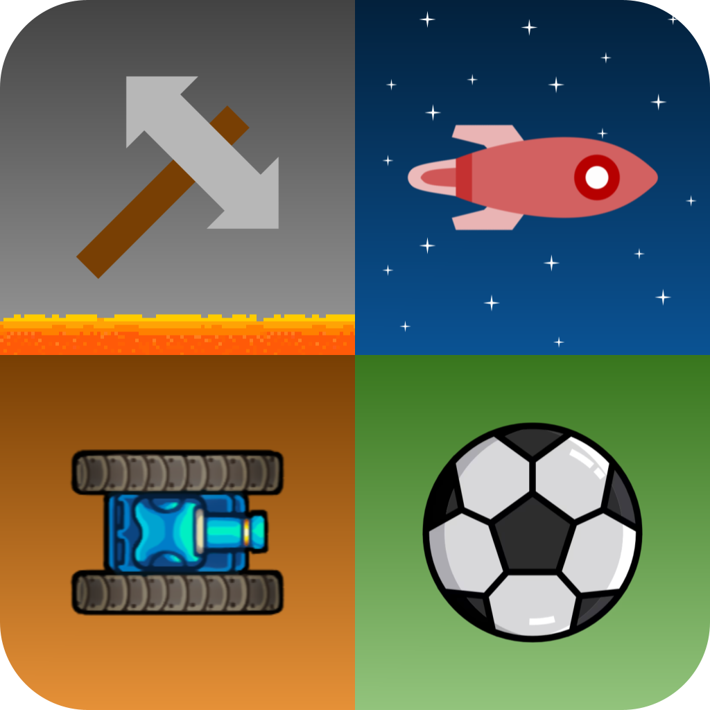

<h1 align="center">Dumb Duels</h1>

**Dumb Duels** is a collection of 2-player minigames. Grab a friend and battle to the (virtual) death!

Dumb Duels is built using our very own **DuelKit** game framework for creating 2-player minigames. DuelKit aims to be modular and flexible, allowing you to build any game of your design, within the constraints of a "micro battle". By following the Entity Component System (ECS) software architectural pattern, game developers can "mix-and-match" DuelKit features extensively.

## Acknowledgements

This project was inspired by Micro Battles. In particular, the axe game and tank game were inspired by [Micro Battles](https://apps.apple.com/us/app/micro-battles/id926251519), while the spaceship game and soccer game were inspired by [Micro Battles 2](https://apps.apple.com/us/app/micro-battles-2/id942435883).
